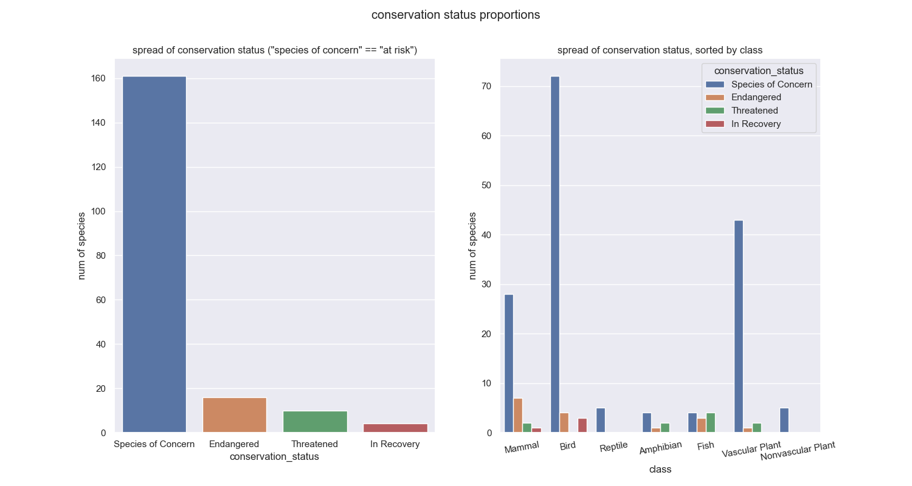

# Introduction:

In this project are CSV files for conservation status and population count for a set of species. This first analysis project will serve as both a guide and a useful template for me to look back to during future data analysis projects.

Goal: Interpret data from the National Parks Service about endangered species in different parks. Investigate if there are any patterns or themes to the types of species that become endangered. Analyze, then clean up, then plot data as well as pose questions and seek to answer them in a meaningful way.

# Analysis Preview:

### Which species were spotted the most at each park?
#### Bryce National Park

scientific name  | num of sightings
------------- | -------------
Aventa sativa  | 163.0
Ophioglossum vulgatum  | 160.0
Certhia familiaris | 158.0
Viola tripartita | 157.0
Amphicarpaea bracteata | 156.0

#### Great Smoky Mountains National Park

scientific name  | num of sightings
------------- | -------------
coming soon

#### Yosemite National Park

scientific name  | num of sightings
------------- | -------------
coming soon

#### Yellowstone National Park

scientific name  | num of sightings
------------- | -------------
coming soon

# Conclusions and takeaways:

Q: What did you learn throughout the process?

A: The number of species in a state of concern, the spread of organism observations throughout parks sorted by species, spread of conservations statuses, the spread of conservation statuses sorted by category of organism, which species are most sighted at each park.

Q: Are the results what you expected?

A: A surprisingly few amount of species have a conservation status. Of the species that are of conservation status at some level, the vast majority are birds or vascular plants. Of the species that do have a conservation status, the vast majority are in the lowest status, "Species of Concern". Only 25-30 species are in any higher level of danger.

Q: What are the key findings and takeaways?

A: Out of 5824 species, 191 have a conservation status. Of those 191, 25-30 are Endangered, Threatened, or In Recovery. Of all organism types, bird species make up the vast majority of species that are in concservation status. Most species in the "Species of Concern" category are of the bird and vascular plant categories. Most species in the "In Recovery" category are birds.

---

To run the analysis:
biodiversity-project.bat
